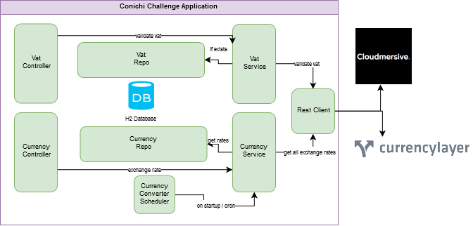
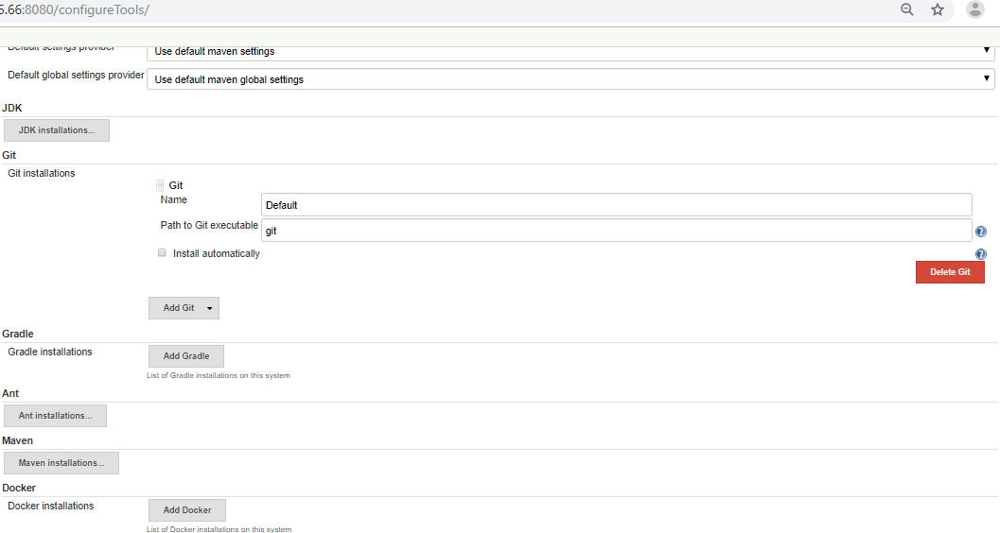
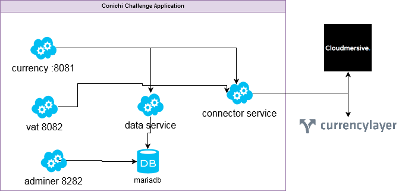

# Conichi Challenge Application

This appication is Conichi Challenge App and its working behaviour is according to given requirenments.
Api document is avaiable at ```/swagger-ui.html```

# ABOUT

  - Serivce can help user to exchnage currencies i.e ```USD``` to ```PKR```
  - Service can help user to verify ```VAT``` number.
    
# Working Flow

  - On-startup ```CurrencyConverterScheduler``` get all exchnage rates from ```currencylayer```
  - A cron bases scheduler in ```CurrencyConverterScheduler``` invokes and get all exchnage rates from ```currencylayer``` and update on ```H2 Database``` if there is change for an exchange rate.
  - Application is exposing two controllers ```/api/currency/convert``` and ```/api/vat/validate``` over port ```8081```
  - when user call ```/api/currency/convert``` it get exchnage rates from ```H2 Database```
  - when uer call ```/api/vat/validate``` it first check in ```H2 Database``` for alredy enty of ```VAT``` if exists return it else get from ```Cloudmersive```, save in ```H2 Database``` and return status.

## Installation
This application contains ```Dockerfile``` 
```sh
FROM openjdk:8-jdk-alpine
VOLUME /tmp
ADD target/conichi-challenge-application-0.0.1-SNAPSHOT.jar app.jar
ENV JAVA_OPTS="-XX:+UseSerialGC -Xss1024k -XX:MaxRAM=512m"
ENTRYPOINT exec java $JAVA_OPTS -Djava.security.egd=file:/dev/./urandom -jar /app.jar
```
### Local Environment
When devloping, many times we want to test out app in acturla ```docker container```. If you want you can test your app duirng on going development using ```Vagrant``` 
### Running JAR in Docker locally
A very simple ```Vagrant``` project focusing this app this exists in ```vagrant``` folder.
You need following tools before you can test ```Vagrant``` locally
  - VartualBox
  - Vagrant
Once they are installed. Goto ```vagrant``` folder and type
```sh
vagrant up
```
this command should take time when its run first time. When its done place your ```target``` folder and ```Dockerfile```  in ```data``` folder taht is in ```vagrant``` folder. then
```sh
vagrant ssh
>>cd /vagrant/vagrant_data
>> ls
```
you should see your ```target`` folder and ```Docerfile``` there
```sh
>>sudo docker build -t conichi .
>>sudo docker run --name -p 8081:8081 Conichi -d conichi
>>sudo docer ps
```
you should see you application running

These are manually setps but are fine for local testing.You can automate this by setting ```Jenkins``` on vagrant and build using that.
add following lines in ```setup.sh``` 
```sh
sudo yum install java-1.8.0-openjdk-devel -y
curl --silent --location http://pkg.jenkins-ci.org/redhat-stable/jenkins.repo | sudo tee /etc/yum.repos.d/jenkins.repo
sudo rpm --import https://jenkins-ci.org/redhat/jenkins-ci.org.key
sudo yum install jenkins -y
sudo systemctl start jenkins
systemctl status jenkins
sudo systemctl enable jenkins
sudo cat /var/lib/jenkins/secrets/initialAdminPassword > /vagrant_data/jenkins_key.txt
```
then on console
```sh
vagrant reload --provision
```
when its up ```vagrant_data/jenkins_key.txt``` should contains jenkins key for setting jenkins.
  - Install recomended plugins
  - Make sure to setup Java, Maven and Docker in ```Global Tool Configuration```

 - create jenkins job and select maven project
 - select ```git``` in ```Source Code Management``` and give repo address and key or password and define ```branch```
 - cehck ```Build whenever a SNAPSHOT dependency is built```
 - in ```post setps``` check ```Run only if build succeeds or is unstable```
 - add 4 ```Execute Shell``` and place each block of ```scrip``` there
```sh
sudo docker build -t conichi .
```
```sh
CONTAINER_NAME='Conichi'
CID=$(V ps -q -f status=exited -f name=^/${CONTAINER_NAME}$)
if [  "${CID}" ]; then
sudo docker ps rm ${CONTAINER_NAME}
fi
unset CID

```
```sh
CONTAINER_NAME='Conichi'
CID=$(sudo docker ps -q -f status=running -f name=^/${CONTAINER_NAME}$)
if [  "${CID}" ]; then
sudo docker stop ${CONTAINER_NAME}
sudo docker rm ${CONTAINER_NAME}
fi
unset CID

```
```sh
sudo docker run --name -p 8081:8081 Conichi -d conichi
```
Runnning this job should pull code from git and push to your ```vagrant``` server locally.

to setop service
```sh
sudo docker stop Conichi
sudo docker rm Conichi
sudo docker rmi conichi
```

### Running in Test or Production
For actually environment you should use ```K8s``` or ```Docker Swarm```. This guide help you seeting in ```Docker Swarm```

For cloud you can use AWS ec2 Instances. Go to AWS console
  - get and Ec2 instance can be ```t2micro``` of centOS/7
  - make sure security group allows 8081 port
  - assign elastic ip - optional
  - generate ```.pem``` key file and use ```putty``` to generate ```.ppk``` key 

**you can use ```Terraform``` for setting insfrastructure on AWS**
A sample ```Terraform``` project is attached for setting windows server on AWS and update its hostname while provisioning. To configure just chnage ```ami``` image.
What this ```Terraform``` should do
    - Create VPC
    - Create Two Subnets public/private
    - Create Router and attach
    - Set an Ec2 Instance of CentOS/7

If you are using ```Terraform``` you should run following scrip on provisioning of ec2 or run it inside ec2 when setting from ```AWS console```
```sh
sudo yum install docker -y
sudo systemctl start docker
sudo yum install java-1.8.0-openjdk-devel -y
curl --silent --location http://pkg.jenkins-ci.org/redhat-stable/jenkins.repo | sudo tee /etc/yum.repos.d/jenkins.repo
sudo rpm --import https://jenkins-ci.org/redhat/jenkins-ci.org.key
sudo yum install jenkins -y
sudo systemctl start jenkins
systemctl status jenkins
sudo systemctl enable jenkins
```
Now, when Terrafrom is up or you are still in CentOs/7 
```sh
docker swarm init --advertise-addr <PrivateIP>
```
you should see following output
```sh
Swarm initialized: current node (viwovkb0bk0kxlk98r78apopo) is now a manager.
To add a worker to this swarm, run the following command:    docker swarm join --token <token> <Ip>:2377
To add a manager to this swarm, run 'docker swarm join-token manager' and follow the instructions.
```
Now you Swarm is setup and your ec2 instance is manager now. You can add more nodes and join ```Swarm``` as manager or worker.
Setup Jenkins 
  - Install recomended plugins
  - Make sure to setup Java, Maven and Docker in ```Global Tool Configuration```

 - create jenkins job and select maven project
 - select ```git``` in ```Source Code Management``` and give repo address and key or password and define ```branch```
 - cehck ```Build whenever a SNAPSHOT dependency is built```
 - in ```post setps``` check ```Run only if build succeeds or is unstable```
 - add 4 ```Execute Shell``` and place each block of ```scrip``` there
```sh
sudo docker build -t 127.0.0.1:5000/conichi .
sudo docker push 127.0.0.1:5000/conichi
```
```sh
SERVICE_NAME='Conichi'
CID=$(sudo docker service ls -q -f name=Conichi)
if [  "${CID}" ]; then
sudo docker service rm 'Conichi'
fi
unset CID
```
```sh
sudo docker service create --name Conichi --publish 8081:8081 --constraint node.role==worker 127.0.0.1:5000/conichi
```
```sh
sudo docker service update --replicas=1 Conichi
```
Now go inside server and verify your service.
```sh
sudo docker service ls
```
Stopping service is different from normal docker insalliation
```sh
docker service scale <SERVICE-ID>=<NUMBER-OF-TASKS>
```
## Improvements


We can improve structure of applcations by seprating services as shown.
If 3rd party api are going to call more then we should also seprate their connectors or might need to seprate db layer as well.
